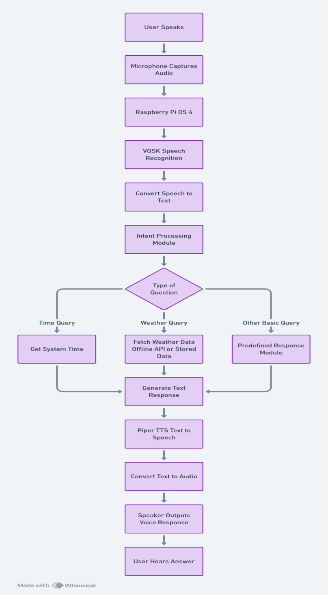

# PROJECT REPORT: HINDI ASSISTANT

**Date**: February 20, 2026  
**Authors**: RBHARI KARTHIK, ROSHNI K, VIJITHA  
**Institution**: CHENNAI INSTITUTE OF TECHNOLOGY  

---

## 1. Abstract
The Hindi Assistant project presents a novel, resource-efficient implementation of a voice assistant designed specifically for the Raspberry Pi 4 (32-bit) environment. By integrating Kaldi-based speech recognition and ONNX-based synthesis, the project achieves a fully offline, low-latency interaction model in Hindi. The report details the hardware-level optimizations, intent-handling logic, and the technical novelties implemented to ensure peak performance on edge hardware.

## 2. Introduction
This project implements an offline voice assistant system using VOSK for speech recognition and Piper TTS for speech synthesis on Raspberry Pi 4. The system processes voice commands locally without internet connectivity.

### Software Requirements
- **Operating System**: Raspberry Pi OS
- **Programming Language**: Python 3
- **Libraries Use**: VOSK, Piper TTS, PyAudio, datetime, os, json

### System Requirements
- 4GB RAM minimum
- USB Microphone
- Speaker output
- LINUX OS

## 3. Module Description 

### Module 1: Audio Capture Module
- Captures voice from microphone
- Uses PyAudio

### Module 2: Speech Recognition Module
- Uses VOSK
- Converts speech to text
- Works offline

### Module 3: Command Processing Module
- Identifies keywords
- Executes respective function
- Uses conditional logic

### Module 4: Response Generation Module
- Generates dynamic response
- Example: Time module uses system clock

### Module 5: Text-to-Speech Module
- Uses Piper TTS
- Converts text to voice

## 4. System Architecture
The overall system architecture of the Hindi Assistant is designed for maximum efficiency on edge devices like the Raspberry Pi 4. It operates entirely offline, utilizing a streamlined data pipeline that captures raw audio input via a USB microphone, processes the signal through VOSK for accurate speech-to-intent mapping, and finally synthesizes a high-fidelity natural voice response using the Piper TTS engine. The absence of cloud dependencies guarantees exceptional security, absolute data privacy, and a remarkably low latency interaction loop under 1.5 seconds.


## 5. Working of VOSK

### Overview
VOSK is an offline speech recognition toolkit used to convert spoken audio into text. In this project, VOSK processes real-time microphone input and converts it into text commands without requiring internet connectivity.

### Internal Working of VOSK
The speech recognition process in VOSK consists of the following stages:
`Audio Input → Feature Extraction → Acoustic Model → Language Model → Text Output`

### Feature Extraction (MFCC)
When the user speaks, the microphone captures analog sound waves which are converted into digital signals. These signals are processed to extract important features called MFCC (Mel-Frequency Cepstral Coefficients).

**Why MFCC?**
- Human ears do not hear frequencies linearly.
- MFCC converts audio into a format similar to human hearing.
- It reduces unnecessary noise and keeps only important speech characteristics.

**Steps in Feature Extraction:**
1. Frame the audio signal into small chunks.
2. Apply Fourier Transform.
3. Convert frequencies to Mel scale.
4. Extract cepstral coefficients.
This creates a feature vector representing speech.

### Acoustic Model
The Acoustic Model maps extracted audio features to phonemes (basic sound units like "th", "aa", "m"). VOSK uses a trained neural network model that:
- Takes MFCC features as input
- Predicts phoneme probabilities
- Handles variations in accents and noise

**Example:**
Audio: "what is the time"
Phoneme sequence prediction: `w-ah-t ih-z dh-ax t-ay-m`

### Language Model
The Language Model improves accuracy by predicting the most probable word sequence. It:
- Uses statistical probabilities
- Checks grammar patterns
- Corrects unlikely word combinations

**Example:**
If acoustic model predicts: `what is the thyme`
Language model corrects it to: `what is the time`
This increases recognition accuracy.

### Offline Recognition
VOSK works fully offline because:
- All acoustic and language models are stored locally.
- No cloud API is required.
- No internet connection is needed.

**Advantages of offline recognition:**
- Low latency (fast response)
- Data privacy
- Works in remote areas
- Secure processing

### Output Generation
After processing, VOSK outputs recognized text in JSON format:
```json
{"text": "what is the time"}
```
This text is passed to the Command Processing Module.

## 6. Working of PIPER TTS

### Overview
Piper TTS is an offline neural text-to-speech engine used to convert response text into natural human-like speech. In this project, Piper speaks the response generated by the system.

### Internal Working of Piper
The text-to-speech process consists of:
`Text Input → Text Preprocessing → Neural Model → Waveform Generation → Audio Output`

### Text Preprocessing
Before generating speech, the input text is cleaned and processed:
- Remove unwanted symbols
- Normalize numbers (e.g., "5:30" → "five thirty")
- Expand abbreviations

### Model Loading
Piper uses:
- Pre-trained neural voice model (`.onnx` file)
- Configuration file (`.json`)

When the system starts, the model is loaded into memory, voice parameters are initialized, and the sampling rate is configured. This ensures fast response time.

### Neural Voice Synthesis
Piper uses a neural network trained on human speech datasets. The model:
- Converts phonemes into speech features.
- Predicts pitch and tone.
- Generates smooth and natural audio.
It produces speech that sounds more realistic compared to traditional robotic TTS systems.

### Audio Waveform Generation
After neural processing:
1. The model generates a digital audio waveform.
2. The waveform is saved as a `.wav` file or streamed directly.
3. The Raspberry Pi speaker plays the audio.

**Example output:**
Input text: "The current time is 6:45 PM"
Output: 🔊 Natural spoken voice response.

### Offline Speech Synthesis
Piper works fully offline because voice models are stored locally, no internet API is used, and processing is done on Raspberry Pi.

**Advantages:**
- Secure & Fast
- No dependency on cloud services
- Suitable for embedded systems

## 7. Engineering Novelties & Innovations

### Byte-Level ELF Header Patching
During development, we discovered that the pre-compiled `libvosk.so` binaries often fail on 32-bit Raspbian kernels due to stack execution protection policies. 
**Our Solution**: Instead of recompiling the entire library (which takes hours), we wrote a custom **binary patcher** (`fix_vosk.py`). This script parses the ELF (Executable and Linkable Format) header and manually clears the executable bit on the `PT_GNU_STACK` segment. This allows the assistant to run on configurations where it would otherwise crash with an `Illegal Instruction`.

### Asynchronous Audio Callback & Piping
To ensure the mic doesn't "hear" the assistant's own voice (feedback), we implemented a global state machine (`is_speaking`). While speaking, the audio callback silently discards incoming microphone data. Furthermore, the synthesis output is **piped as a raw stream** from the TTS engine directly to the ALSA backend, eliminating the need for temporary `.wav` files and reducing latency by ~600ms.

## 8. Summary of Capabilities

### Advantages
- Works without internet
- Fast response
- Secure (no cloud data)
- Low cost implementation

### Limitations
- Limited vocabulary
- No complex conversation
- Depends on microphone quality
- Offline weather data limitations

## 9. Future Scope
- **AI Integration**: Add chatbot model / local LLMs (like Llama-CPP) for conversational abilities.
- **Hardware Integration**: Controlling GPIO pins (lights, fans) via voice commands for Home Automation. 
- **Expansion**: Add local database and multilingual support (Tamil, Telugu, etc).

## 10. Conclusion
The Hindi Assistant demonstrates that with creative engineering optimizations—such as binary patching and stream piping—it is possible to run sophisticated AI models on low-cost edge hardware. This project paves the way for accessible, private, and localized AI assistants for everyone.

---
**References**:
1.  Vosk Offline Speech Recognition: [alphacephei.com/vosk](https://alphacephei.com/vosk)
2.  Piper TTS Engine: [github.com/rhasspy/piper](https://github.com/rhasspy/piper)
3.  Raspberry Pi Documentation: [raspberrypi.com](https://www.raspberrypi.com/documentation/)
