# 🇮🇳 Hindi Assistant: Edge-Based Multi-Voice Vernacular AI

> **A high-performance, 100% offline Hindi Voice Assistant engineered for Raspberry Pi 4. Bridging the digital divide through localized Edge AI.**


---

## 🚀 Overview
The **Hindi Assistant** is more than just a chatbot; it is a localized edge computing solution designed to provide digital assistance to Hindi-speaking populations without the need for high-speed internet or expensive cloud subscriptions. Built using a combination of **Kaldi-based speech recognition** and **ONNX-optimized speech synthesis**, it delivers a seamless, low-latency user experience on a 32-bit ARM architecture.

## 💎 Novelty & Key Innovations

### 1. The "Zero-Latency" Audio Pipe
Traditional assistants save TTS to a file and then play it (e.g., `piper -> file.wav -> aplay`). This introduces significant disk I/O latency. Our implementation uses a **Direct Unix Pipe** (`Process -> Stdout -> Stdin -> Aplay`), allowing audio to begin playing almost the millisecond it is generated.

### 2. Custom ELF Binary Patching (`fix_vosk.py`)
A major hurdle on 32-bit Raspberry Pi OS is the "Illegal Instruction" error caused by modern Python library binaries. We developed a novelty script to **patch the ELF header** of `libvosk.so` in-place, marking the stack as non-executable at the byte level. This hardware-level fix allows the assistant to run on kernels where standard installations fail.

### 3. Edge-First Privacy
Unlike Alexa or Siri, **zero bytes of voice data** leave the Raspberry Pi. The recognition, intent handling, and synthesis all happen locally. This makes it an ideal solution for sensitive environments or regions with intermittent connectivity.

### 4. Dynamic Multi-Voice Synthesis
Supports real-time switching between high-fidelity male (**Rohan**) and female (**Priyamvada**) voices using the **Piper** TTS engine, optimized for the `armv7l` chipset.

---

## 🛠️ Technical Stack
*   **Speech-to-Text (STT)**: [Vosk](https://alphacephei.com/vosk/) (Kaldi-based)
    *   *Model*: `vosk-model-small-hi-0.22` (Optimized for Edge devices)
*   **Text-to-Speech (TTS)**: [Piper](https://github.com/rhasspy/piper) (ONNX)
    *   *Voices*: Rohan & Priyamvada (Medium Quality)
*   **Audio Backend**: ALSA (Advanced Linux Sound Architecture) & PortAudio via `sounddevice`.
*   **Hardware**: Raspberry Pi 4 Model B (Broadcom BCM2711, Quad core Cortex-A72).

---

## 🏗️ System Architecture

```mermaid
graph LR
    subgraph Hardware ["User Interface (Hardware)"]
        Mic["🎤 Microphone Input"]
        Spk["🔊 Speaker Output"]
    end

    subgraph Engine ["Core AI Stack (On-Device)"]
        STT["🧠 Vosk STT Engine<br/>(Kaldi-based)"]
        Intent["⚡ Logic Hub<br/>(Intent Processor)"]
        TTS["🗣️ Piper TTS Engine<br/>(ONNX Inference)"]
    end

    subgraph Optimization ["Optimization Layer"]
        Patch["🛠️ ELF Patcher<br/>(Binary Fix)"]
        Pipe["🌊 Unix Audio Pipe<br/>(Zero-Latency)"]
    end

    Mic ---|Raw 16kHz Audio| STT
    STT -->|Localized Text| Intent
    Intent -->|Synthesis String| TTS
    TTS -->|PCM Stream| Pipe
    Pipe --> Spk
    
    Patch -.->|Patching libvosk.so| STT
    
    style Hardware fill:#f9f,stroke:#333,stroke-width:2px
    style Engine fill:#bbf,stroke:#333,stroke-width:2px
    style Optimization fill:#dfd,stroke:#333,stroke-width:2px
```



---

## 📥 Installation & Setup

### 1. Repository Preparation
```bash
git clone https://github.com/harikarthik257/hindi_assistant.git
cd hindi_assistant
```

### 2. Automated Provisioning
We provide a comprehensive setup script that handles system dependencies, model downloads, and permissions:
```bash
chmod +x setup_rpi.sh
./setup_rpi.sh
```

### 3. The "Vosk Patch" (Novelty)
If you encounter execution errors on 32-bit systems, our custom patcher fixes the binary compatibility:
```bash
python3 fix_vosk.py
```

---

## 🗣️ Use Cases & Commands
- **Wake Words**: `सुनो` (Listen), `हेलो` (Hello), `अरे` (Hey)
- **Time/Date**: "अभी क्या समय हुआ है?"
- **Identity**: "तुम्हारा नाम क्या है?"
- **Voice Customization**: "आवाज़ बदलो" (Switch to female/male)
- **Entertainment**: "चुटकुला सुनाओ" (Tell a joke)
- **System Control**: "सिस्टम बंद करो" (Shutdown)

---

## 👥 Developers
*   **rbhari karthik** - *Architect & Lead Developer* ([GitHub](https://github.com/harikarthik257))
*   **roshni k** - *NLP & Testing Specialist*

## 📜 License
Distribute under the MIT License. See `LICENSE` for more information.

---
*Developed for the 2026 Hackathon - Empowering the Next Billion.*
